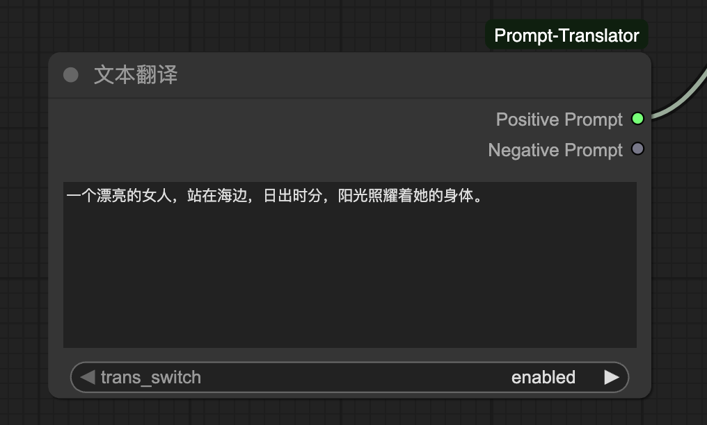

# ComfyUI-Prompt-Translator
ComfyUI 通过语言模型自动翻译 Prompt 为中文提示词插件。  

该插件使用了 [BigModel](https://bigmodel.cn/) 的 API 来实现翻译功能。

## 使用方法

1. 下载插件到 ComfyUI 的 `custom_nodes` 目录下。
2. 在 ComfyUI 中添加 `PromptTranslator` 节点。
3. 在 `PromptTranslator` 节点中输入需要翻译的中文提示词。

### 需要自己修改为自己的免费APIKey

* 找到`BIGMODEL_API_KEY`后面添加自己的apikey即可。

### example

